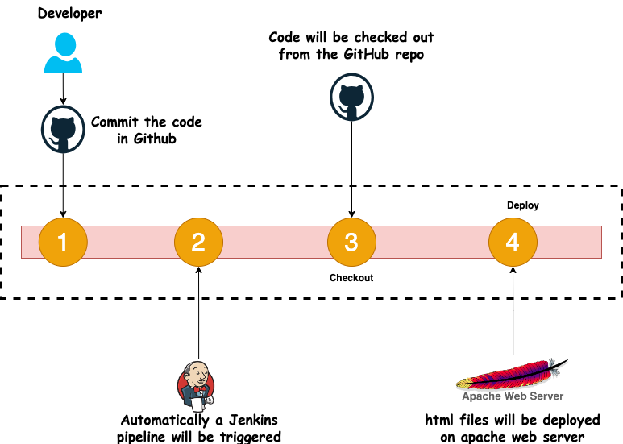
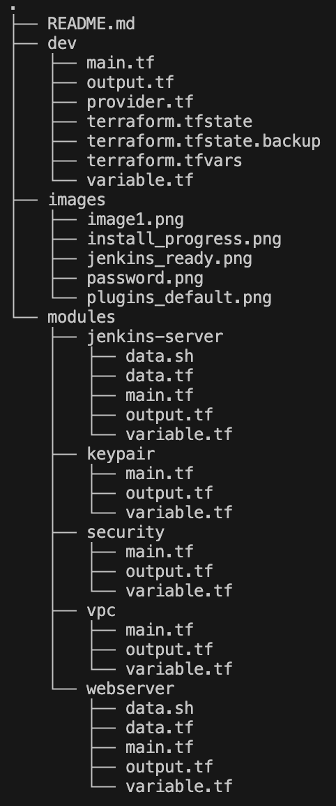
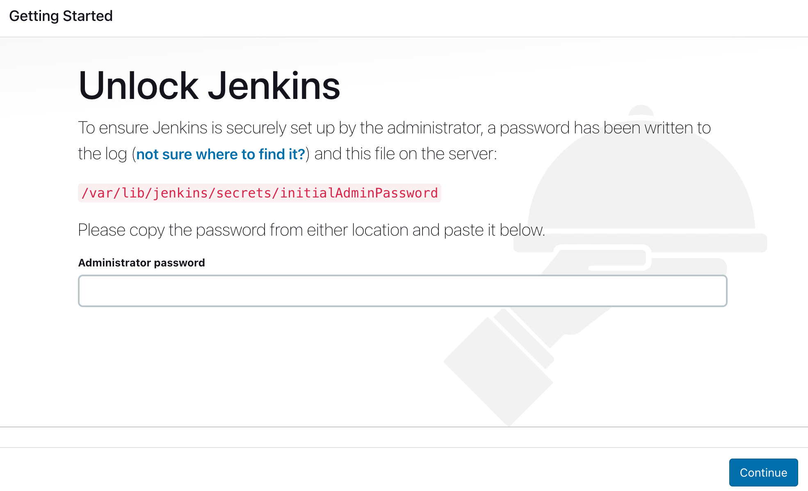
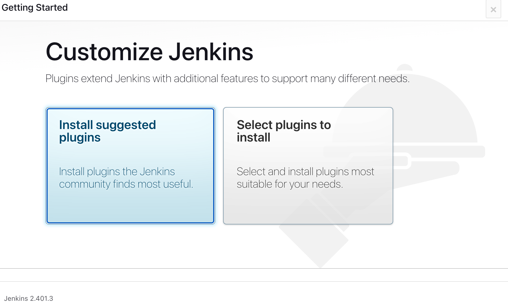
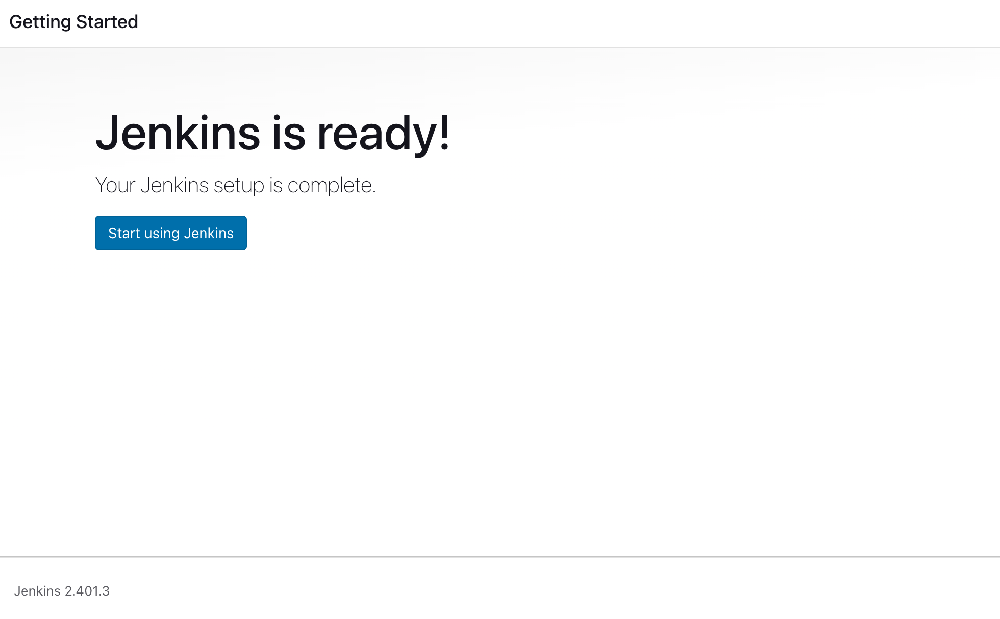

# Deploy Personal portfolio webpage using Jenkins and Github webhook on Apache and AWS infrastructure provisioning using terraform

In the ever-evolving landscape of web development, the ability to efficiently deploy and manage a webpage is crucial for ensuring a seamless online experience. Leveraging automation tools and integrations can significantly enhance this process. One such powerful combination involves utilizing Jenkins, a popular automation server, in conjunction with GitHub webhooks, to effortlessly deploy web content. When paired with an Apache web server, this dynamic trio forms a robust ecosystem for managing and serving webpages. In this introduction, we embark on a journey to explore how to deploy a webpage using the collaborative prowess of Jenkins and GitHub webhooks, all while harnessing the reliable capabilities of an Apache web server. By following this guide, you'll be well on your way to optimizing your deployment workflow and delivering web content with precision and ease.



# Infrastructure Provisioning Using terraform 

Here we first provision Jenkins server in aws instances where jenkins is installed and webserver instance where apache installed in aws EC2 instances. 


## Terraform

### Pre-requisite:

- Please make sure you create a provider.tf file

```javascript
provider "aws" {
  region                  = var.region
  shared_credentials_file = "~/.aws/credentials"
  profile                 = "default"
}
```

The ‘credentials file’ will contain 'aws_access_key_id' and 'aws_secret_access_key'.

- Keep SSH keys handy for server/slave machines.

Here is a nice article [link](https://www.digitalocean.com/community/tutorials/how-to-set-up-ssh-keys-2) highlighting how to create it or else create them beforehand on AWS console and reference it in the code.



For simplicity purpose, we will be using Linux machine for creating Jenkins server and Linux webserver. It’s now time to start using terraform for creating the machines.

#### VPC

The module VPC creates virtual private cloud.

#### Security

The module contains terraform code to create instance level traffic inflow and outflow rules.

#### keypair

The module keypair contains terraform code to create ssh keypair on AWS console.

#### Jenkins-Server

This module contains terraform code to create Jenkins-server with jenkins.

#### Webserver

This module contains terraform code to create webserver with apache.

### Run the terraform code

To deploy master and slave aws instances, run terraform command under the directory **/dev** because all modules are invoked and deployed from this folder.

```bash
terraform init
```

```bash
terraform validate
```

```bash
terraform apply --auto-approve
```

## Script for jenkins server and Apache webserver

#### Install jenkins on jenkin-server node

```bash

#!/bin/bash
#################################
# Author: Santosh
# Date: 8th-August-2023
# version 1
# This code install jenkins in the ubuntu instances
##################################

sudo apt update -y
sudo apt install openjdk-17-jre -y
curl -fsSL https://pkg.jenkins.io/debian-stable/jenkins.io-2023.key | sudo tee \
 /usr/share/keyrings/jenkins-keyring.asc > /dev/null
echo deb [signed-by=/usr/share/keyrings/jenkins-keyring.asc] \
 https://pkg.jenkins.io/debian-stable binary/ | sudo tee \
 /etc/apt/sources.list.d/jenkins.list > /dev/null
sudo apt-get update
sudo apt-get install jenkins -y
sudo systemctl enable jenkins
sudo systemctl start jenkins

```

(This script is on jenkins-server as data.sh and renders on EC2 instance when terraform deploy via command.)

##### Access URL 
###### http://public IP of Jenkins server:8080

We wiil be asked to enter default admin password like below:

In order to access the default admin password we need to login to the jenkins server and run the command

```bash
sudo cat /var/lib/jenkins/secrets/intialAdminPassword
```

and copy & paste in the windows.

On next screen you can see its asking to install the suggested plugins -

On the next screen you will be prompted to create jenkins user and finally we will get default Jenkins Dashboard:


#### Install Apache on webserver node
```bash
#!/bin/bash
#################################
# Author: Santosh
# Date: 8th-August-2023
# version 1
# This code install Apache in the ubuntu instances 
##################################


sudo apt update -y
sudo apt install apache2 -y
sudo systemctl status apache2

```
##### Access URL 
###### <http:// public IP of apache webserver>

#### Create ssh keys keypair by the modules keypair in the terraform.
This keypair modules create public key.

```javascript
//Create a key with RSA algorithm with 4096 rsa bits
resource "tls_private_key" "private_key" {
  algorithm = var.keypair_algorithm
  rsa_bits  = var.rsa_bit
}

//create a key pair using above private key
resource "aws_key_pair" "keypair" {
  key_name   = var.keypair_name
  public_key = tls_private_key.private_key.public_key_openssh
  depends_on = [tls_private_key.private_key]
}

//saving the private key at the specific location
resource "local_file" "save-key" {
  content = tls_private_key.private_key.private_key_pem
  //path.module is the module that access current working directory
  filename = "${path.module}/${var.keypair_name}.pem"
  // changes the file permission to read-only mode
  file_permission = "0400"
  depends_on      = [tls_private_key.private_key]
}

```

(Here ssh keypair is created of both jenkins server instance and apache webserver instances and downloaded in the modules keypair and changes to read only permission on the keypair for security reason.)
```bash
ssh -i <kepair-name.pem> <username>@<public-ip-address>
```


#### Copy keys on master node

In Order to copy the keys on the master use following steps:

- Dashboard
- Manage Jenkins
- Credentials
- System
- Global Credentials(Unrestricted)
- Add credentials


Final output:


#### Join slave node to master

To join the Jenkins slave node to Jenkins Master, perform below steps -

- Select Build Executor Status > **New Node** > **Type** - **Permanent**
- Name : **jenkins-slave1**
- Description : **jenkins-slave1**
- Number of executors : **1**
- Remote root directory : **/home/ubuntu/slave1**
- Labels : **jenkins-slave1**
- Usage : **Use this mode as much as possible**
- Launch method : **Launch agents via SSH**
- Host : **<public ip of slave node> e.g. 192.168.0.103**
- Credentials : **Select the corresponding global credentials key of agents**
- Host Key Verification Strategy : **manually trusted key verification strategy**
- Save and check that new slave node is added and is in sync


#### Test the setup

- Create **New item**
- Enter an item name as **Job1**
- Choose **freestyle project**
- Select Build as **"Execute shell"** and run echo command - **"Testing Jenkins Master Slave Setup"**
- Save and run build - **"Build Now"** and Once the build is completed we can check the console output and gets following output


**Important Note:**
Jenkins main controller should execute the job for security reasons therefore, it should pass the job to the corresponding slave nodes and it should be used as maintaining information of the job executed. Therefore, its executors should be set to zero.

- Click at master node
- Configure
- No. of executors: **0**
- Labels: **scrambled text i.e. fdkasjfkdsakfjdksaj**
- Usage: **only build with labels expressions matching this node**
- Save

